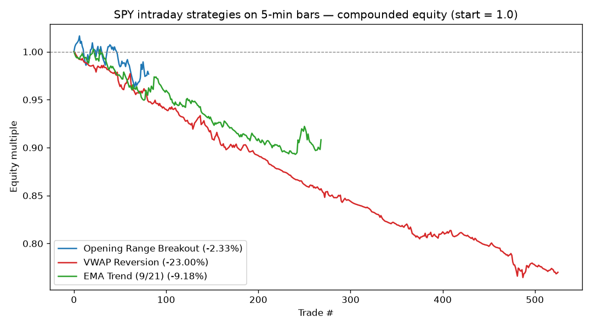

# SPY Intraday Backtest — ORB vs. VWAP Reversion vs. EMA Trend

An honest backtest comparing three commonly-cited day-trading methods on SPY,
across two bar granularities. **Educational only — not financial advice.**

## What it tests

| Strategy | Type | Logic |
|----------|------|-------|
| **Opening Range Breakout (ORB)** | Breakout | First 30 min sets the range. Take the first break — long above the high, short below the low. Stop = opposite side. Exit at the close. One trade/day. |
| **VWAP Reversion** | Mean reversion | Intraday cumulative VWAP with an expanding ±σ band. Fade extensions: long 1.5σ below VWAP, short 1.5σ above. Exit on reversion to VWAP, a 3σ stop, or the close. |
| **EMA Trend (9/21)** | Momentum / trend | Always-in fast/slow EMA crossover, computed per session. Long when fast EMA > slow, short when below, flip on the cross. Flat at the close. |

All strategies are **intraday only — flat overnight**, with a **4 bps
round-trip slippage cost** on every trade. Each trade is sized at full equity,
so "total return" is compounded.

## Data

- `data/spy_30min.json` — 30-min bars, real volume from 2026-01-30 → 06-17 (**96 sessions**).
- `data/spy_5min.json` — 5-min bars, real volume from 2026-02-23 → 06-17 (**81 sessions**).
- Both pulled from the broker market-data feed. Gap-fill bars (volume 0) are
  dropped automatically. The EMA trend strategy needs many bars per session, so
  it only runs on the 5-min file.

## Results

### 30-minute bars (Jan 30 – Jun 17, 96 sessions) — buy & hold **+7.15%**

| Strategy | Trades | Win % | Profit factor | Total return | Max DD |
|---|---|---|---|---|---|
| Opening Range Breakout | 96 | 49.0% | 1.08 | **+1.33%** | −4.35% |
| VWAP Reversion | 182 | 39.6% | 0.59 | **−10.53%** | −11.21% |

### 5-minute bars (Feb 23 – Jun 17, 81 sessions) — buy & hold **+7.77%**

| Strategy | Trades | Win % | Profit factor | Total return | Max DD |
|---|---|---|---|---|---|
| Opening Range Breakout | 81 | 45.7% | 0.87 | **−2.33%** | −5.24% |
| VWAP Reversion | 525 | 31.0% | 0.49 | **−23.00%** | −23.48% |
| EMA Trend (9/21) | 268 | 31.3% | 0.71 | **−9.18%** | −10.95% |



## Takeaways

- **Finer bars killed the ORB "edge."** On 30-min bars ORB looked marginally
  positive (+1.33%); on realistic 5-min bars it went **negative (−2.33%)**. The
  coarse-bar profit was partly an artifact of optimistic fills and not modeling
  intrabar stop/target sequencing. This is the classic way a backtest lies to
  you — **the edge was in the resolution, not the market.**
- **More trading = more bleeding.** VWAP reversion fired 182 trades on 30-min
  and **525** on 5-min, and the finer version lost more than twice as much
  (−23%). Costs + fading a trending tape compound against you.
- **The momentum version lost too (−9.18%).** Intraday EMA crossovers get
  whipsawed in chop, and because the strategy is flat overnight it **misses
  SPY's overnight drift** — which is where much of the +7.77% buy-&-hold return
  actually accrued. Trend-following's whole premise needs sustained moves; a
  single ticker intraday rarely supplies them.
- **None of the three beat simply holding SPY.** All three *lost money* on the
  honest 5-min test while buy & hold made ~+7.8%.

The bottom line from earlier holds, now measured twice: **there is no "proven
to make money" intraday setup.** Edges are thin, regime-dependent, costed away,
and fragile to backtest assumptions.

## Caveats

- **Small sample, one regime** (~3–5 months of a generally rising market).
- **Fills are optimistic** (breakouts assumed to fill at the exact level).
- **Single configs, no parameter search** — and you should resist running one,
  or you'll overfit a curve to this specific window.
- 5-min still doesn't capture tick-level sequencing; it's closer to reality
  than 30-min, not reality itself.

## Run it

```bash
pip install pandas numpy matplotlib
python3 backtest/backtest.py
```

Outputs in `results/`: `summary.csv`, per-strategy/per-dataset trade CSVs, and
`equity_curve_5min.png`.
