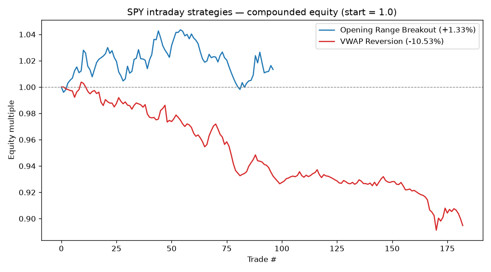

# SPY Intraday Backtest — ORB vs. VWAP Reversion

A small, honest backtest comparing two commonly-cited day-trading methods on
SPY. **Educational only — not financial advice.**

## What it tests

| Strategy | Logic |
|----------|-------|
| **Opening Range Breakout (ORB)** | The first 30-min bar (9:30–10:00 ET) sets the range. Take the first break of that range — long above the high, short below the low. Stop = opposite side of the range. Exit at the session close if not stopped. One trade/day. |
| **VWAP Reversion** | Build an intraday cumulative VWAP with an expanding ±σ band. Fade extensions: long when price is 1.5σ *below* VWAP, short when 1.5σ *above*. Exit on reversion to VWAP, a 3σ stop, or the close. |

Both are **intraday only — flat overnight.** A 4 bps round-trip cost
(slippage) is charged on every trade. Each trade is sized at full equity, so
"total return" is compounded.

## Data

- `data/spy_30min.json` — 30-minute SPY bars (regular hours), pulled from the
  broker market-data feed.
- The feed carries real intraday volume back to **2026-01-30**, giving
  **96 trading sessions** (1,248 bars) through 2026-06-17. Earlier bars are
  gap-fill placeholders (volume 0) and are dropped automatically.

## Results (Jan 30 – Jun 17, 2026)

| Metric | ORB | VWAP Reversion |
|---|---|---|
| Trades | 96 | 182 |
| Win rate | 49.0% | 39.6% |
| Avg trade | +0.02% | −0.06% |
| Profit factor | 1.08 | 0.59 |
| **Total return (compounded)** | **+1.33%** | **−10.53%** |
| Max drawdown | −4.35% | −11.21% |
| **Buy & hold benchmark** | **+7.15%** | **+7.15%** |



## Takeaways

- **Neither method beat buy & hold.** SPY simply holding returned +7.15% over
  the window; ORB returned +1.33% while taking on a 4%+ drawdown, and the naive
  VWAP-fade *lost* 10.5%.
- **ORB was roughly break-even** after costs (profit factor 1.08, ~49% win
  rate). Its edge is thin and fragile on 30-min bars — the kind of thing that
  evaporates with slightly worse fills.
- **Mean-reversion fought the tape and lost.** Fading every stretch from VWAP
  in a market that trended *up* for months means repeatedly shorting strength
  and getting run over. Mean reversion needs range-bound conditions; this
  period wasn't one.
- This is exactly the earlier point: there's **no "proven to make money"
  setup.** Edges are regime-dependent, thin, and easily eaten by costs.

## Caveats (read these)

- **Coarse bars.** 30-min granularity misses intrabar sequencing (e.g., whether
  the stop or target hit first). Finer data (1–5 min) would change the numbers.
- **Small sample, one regime.** ~4.5 months of a generally rising market. One
  trending regime tells you little about how these behave in chop or selloffs.
- **Optimistic fills.** Breakouts are assumed to fill at the exact range level.
- **No parameter search** — and you shouldn't naively run one, or you'll just
  overfit. These are single illustrative configs.

## Run it

```bash
pip install pandas numpy matplotlib
python3 backtest/backtest.py
```

Outputs land in `results/`: `summary.csv`, `trades_orb.csv`,
`trades_vwap.csv`, and `equity_curve.png`.
